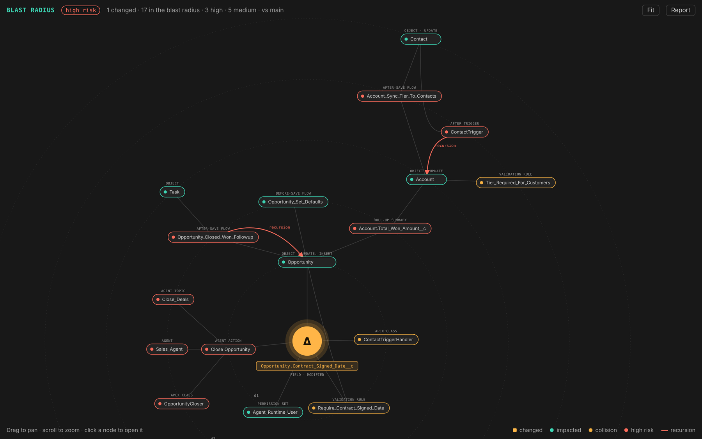

# sf-preflight for VS Code

See what a Salesforce change sets off **before it ships**: the flows, triggers, validation rules,
roll-ups, permissions and Agentforce actions it reaches, the risks, and the tests that matter.
Findings appear in the Problems panel as you work, and the blast radius sits beside your code.

Built on [sf-preflight](https://github.com/visparashar/sf-preflight), the open-source change
analyzer for Salesforce DX. The analysis runs locally on your source and git history: no org
connection, no credentials, and the extension sends nothing anywhere. (When an AI agent in the
editor calls its tools, the results go to that agent's model provider, like any other context.)

> **Preview.** The analysis engine is the same as the sf-preflight CLI (0.7), used on pull requests;
> the editor integration is new. Please [report anything odd](https://github.com/visparashar/sf-preflight/issues).

## Get started

1. Open a Salesforce DX project (a folder with `sfdx-project.json`) that's in a git repository,
   and trust the workspace when asked.
2. Change some metadata: an Apex class, a flow, a validation rule, a field. Save it.
3. Open **sf-preflight** in the activity bar, or click **Preflight** in the status bar. Findings
   are also in the Problems panel (`Ctrl+Shift+M` / `Cmd+Shift+M`).

Nothing to configure, and no org login needed.

## What you get

- **Blast radius graph**: the change at the centre and everything it sets off around it, one ring
  per hop, coloured by risk, with automation cycles drawn as recursion arrows. Hover a node for
  its findings; click it to open the file. Open it with the graph button on the Blast radius view.
- **Problems panel**: each finding on the file it's about (at the line, when known), with a link
  to the rule's explanation. High findings are errors, medium are warnings.
- **Blast radius view** (activity bar): the change's risk, its findings, the changed components,
  and **what runs** on every impacted object, in Salesforce's order of execution, with what each
  step writes. Automation cycles and affected Agentforce actions get their own sections. Click an
  item to open its file.
- **Status bar**: high and medium findings at a glance.
- **Analyze on change**: saving Salesforce metadata, switching branches, pulling or retrieving
  re-runs the analysis a moment later, in the background, one run per project at a time.

Commands (`sf-preflight:` in the Command Palette):

| Command | What it does |
|---|---|
| Analyze changes | Run the analysis now |
| Show blast-radius graph | The change and what it sets off, as a graph beside your code |
| Compare with branch… | Choose what your changes are compared with |
| Show report | The full Markdown report, as posted on pull requests |
| Explain what runs when an object is saved… | Order of execution for any object and event |
| Generate Apex tests for this change | Bulk, recursion, idempotency and validation-error tests in `preflight-tests/` |
| Install the agent skill in this project | Teaches Copilot, Claude, Codex, Cursor and Gemini agents to check their Salesforce changes |

## What "changes" means

The extension compares your working tree (including uncommitted and new files) with the point
where your branch left the repository's default branch (`origin/HEAD`, `origin/main`, …). So it
shows everything your branch changes, and not what others merged since. Set
`sfPreflight.baseRef` to compare with another branch, or to `HEAD` for uncommitted changes only.

## AI agents in the editor

In VS Code 1.101 and later, the extension offers the sf-preflight MCP server to agent mode, so
GitHub Copilot and other agents can analyze their own changes, explain save order, find field
references and generate tests. Turn it off with `sfPreflight.mcp.enabled`. The server runs on the
editor's built-in Node.js; nothing else needs installing.

## Settings

| Setting | Default | |
|---|---|---|
| `sfPreflight.baseRef` | default branch | Branch or commit to compare with; `HEAD` for uncommitted changes only. Per workspace folder |
| `sfPreflight.analyzeOnSave` | `true` | Analyze again when Salesforce metadata changes: saves, and also git checkouts, pulls and retrieves |
| `sfPreflight.minSeverity` | `low` | Lowest severity shown in the Problems panel |
| `sfPreflight.depth` | `4` | Levels of automation cascade to follow |
| `sfPreflight.mcp.enabled` | `true` | Offer the MCP server to agent mode |

A `.preflight.json` in the project (rule severities, ignored paths) applies here too.

## Requirements

A folder with `sfdx-project.json` in a git repository, opened as a trusted workspace (the extension
runs git and writes generated tests and the agent skill into the project). Works in VS Code 1.96+
and editors built on it, such as Cursor and Salesforce Code Builder, through the VS Code
Marketplace or Open VSX.

Only Salesforce source in the project's package directories counts as part of a change, so
generated tests in `preflight-tests/` don't show up as changes until you move them into one.

## More of sf-preflight

The same analysis runs in other places your changes go through:

- **Pull requests**: the [GitHub Action](https://github.com/visparashar/sf-preflight#on-pull-requests-github-action)
  posts the blast radius as a comment and can gate merges.
- **Terminal and any CI**: `npm install -g sf-preflight`, then `preflight analyze`.
- **AI coding agents** outside VS Code (Claude Code, Codex, Cursor, Gemini CLI and others): the
  [agent skill and MCP server](https://github.com/visparashar/sf-preflight/blob/main/docs/AI_AGENTS.md).

Org-connected features (production incidents, partial rollback, Testing Center runs, check-only
test runs) are in the [CLI](https://github.com/visparashar/sf-preflight#readme).

## Feedback

Questions and ideas: [Discussions](https://github.com/visparashar/sf-preflight/discussions).
Bugs: [Issues](https://github.com/visparashar/sf-preflight/issues). sf-preflight is open source
under the Apache-2.0 licence.
